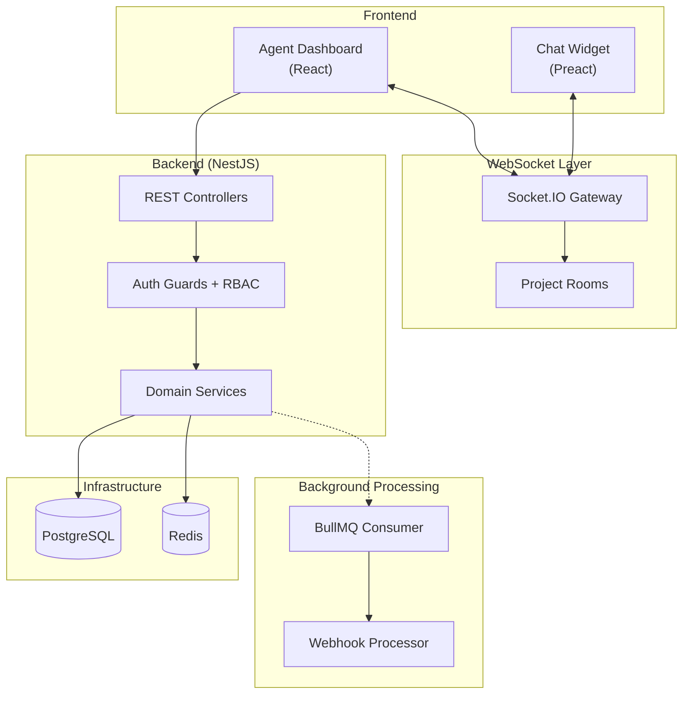
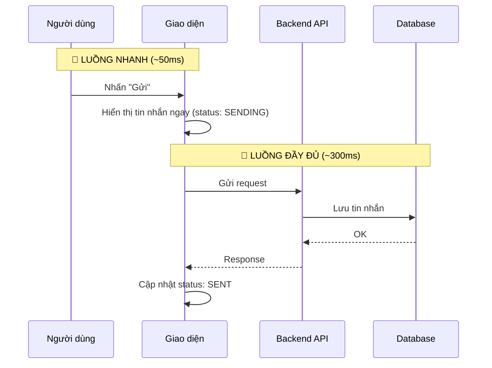
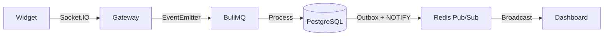
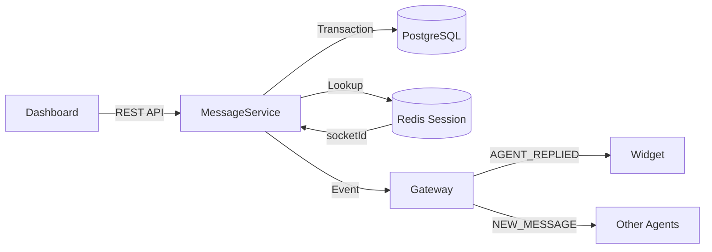
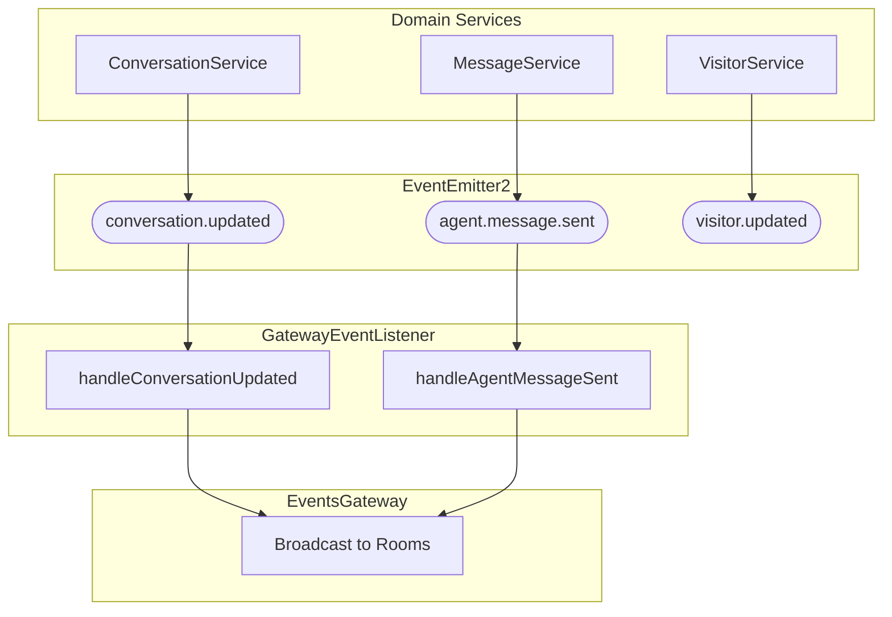
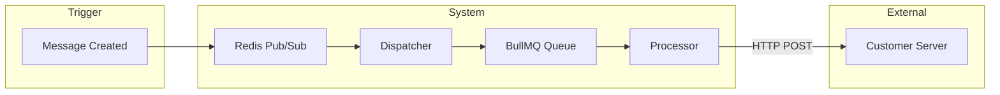

# 🎤 Member 1: System Architect - Tài Liệu Thuyết Trình Hoàn Chỉnh

> **Thời lượng:** ~20-25 phút | **Vai trò:** Mở đầu + Kết thúc buổi thuyết trình

---

# PHẦN 1: MỞ ĐẦU (2 phút)

## 📽️ SLIDE 1.1: Tiêu đề

| Nội dung trình chiếu |
|---------------------|
| **Live Chat System** |
| *Real-time Customer Support Platform* |
| --- |
| 👤 Member 1: System Architect |

### 🎙️ Script:

> "Xin chào mọi người. Hôm nay nhóm chúng tôi sẽ trình bày về hệ thống **Live Chat** - một nền tảng hỗ trợ khách hàng theo thời gian thực.
>
> Tôi là Member 1, đảm nhận vai trò **System Architect**. Tôi sẽ giới thiệu tổng quan về kiến trúc hệ thống, cách triển khai, và các cơ chế bảo mật.
>
> Sau phần của tôi, các thành viên khác sẽ đi sâu vào từng module cụ thể."

---

## 📽️ SLIDE 1.2: Tổng quan hệ thống

| Đặc điểm | Mô tả |
|----------|-------|
| **Loại ứng dụng** | Customer Support Chat |
| **Kiến trúc** | Event-Driven Microservices |
| **Real-time** | WebSocket (Socket.IO) |
| **Multi-tenant** | Cô lập dữ liệu theo Project |

### 🎙️ Script:

> "Đây là hệ thống cho phép **khách hàng** (visitor) trò chuyện trực tiếp với **nhân viên hỗ trợ** (agent) thông qua một widget nhúng vào website.
>
> Hệ thống được xây dựng theo kiến trúc **Event-Driven**, nghĩa là các thành phần giao tiếp với nhau thông qua sự kiện thay vì gọi trực tiếp.
>
> Điểm đặc biệt là hệ thống hỗ trợ **multi-tenant** - nhiều công ty khác nhau có thể sử dụng chung hệ thống mà dữ liệu được cô lập hoàn toàn."

---

# PHẦN 2: KIẾN TRÚC TỔNG THỂ (5 phút)

## 📽️ SLIDE 2.1: Sơ đồ các thành phần



### 🎙️ Script:

> "Đây là sơ đồ tổng quan các thành phần của hệ thống:
>
> **Tầng Frontend** gồm 2 phần:
> - **Agent Dashboard**: Giao diện cho nhân viên hỗ trợ, viết bằng React
> - **Chat Widget**: Widget nhúng vào website khách hàng, viết bằng Preact để nhẹ hơn
>
> **Tầng WebSocket** xử lý tất cả kết nối real-time. Chúng tôi dùng Socket.IO với cơ chế **Room** để cô lập sự kiện theo từng project.
>
> **Tầng Backend** là NestJS với các Controller xử lý REST API, Services chứa business logic, và Guards để xác thực quyền.
>
> **Background Workers** xử lý các tác vụ nặng như gửi webhook, không block main thread.
>
> **Infrastructure** gồm PostgreSQL lưu trữ dữ liệu và Redis cho cache, queue, và pub/sub."

---

## 📽️ SLIDE 2.2: Multi-Tenancy với Projects

| Khái niệm | Giải thích |
|-----------|-----------|
| **Project** | Đơn vị cô lập dữ liệu gốc |
| **ProjectMember** | Liên kết User với Project |
| **Role Hierarchy** | MANAGER > AGENT |

```
Mọi entity → projectId → Cô lập hoàn toàn
```

### 🎙️ Script:

> "Hệ thống sử dụng **Project** làm đơn vị cô lập dữ liệu. Mọi dữ liệu như conversation, message, visitor đều gắn với một projectId.
>
> Điều này đảm bảo **dữ liệu của công ty A không bao giờ lẫn với công ty B**, dù họ sử dụng chung hệ thống.
>
> Về phân quyền, chúng tôi có 2 role:
> - **Manager**: Có toàn quyền quản lý project, cấu hình, xem báo cáo
> - **Agent**: Chỉ có quyền chat với khách và quản lý conversation
>
> Mọi request đều phải qua bước validate **project membership** trước khi xử lý."

---

## 📽️ SLIDE 2.3: Luồng tin nhắn - Optimistic UI Pattern



### 🎙️ Script:

> "Một trong những pattern quan trọng nhất của hệ thống là **Optimistic UI**.
>
> Khi người dùng nhấn gửi tin nhắn, có **2 luồng chạy song song**:
>
> **Luồng nhanh**: Tin nhắn hiển thị **ngay lập tức** trên giao diện với trạng thái 'Đang gửi'. Người dùng không phải chờ đợi, cảm giác ứng dụng rất nhanh.
>
> **Luồng đầy đủ**: Đồng thời, request được gửi đến backend để lưu vào database. Khi hoàn tất, trạng thái chuyển thành 'Đã gửi'.
>
> Nếu backend thất bại, tin nhắn sẽ chuyển sang trạng thái 'Thất bại' và người dùng có thể gửi lại."

---

## 📽️ SLIDE 2.4: Chi tiết luồng Visitor → Agent



| Bước | Công nghệ | Mục đích |
|------|-----------|----------|
| 1 | Socket.IO | Gửi tin nhắn real-time |
| 2 | EventEmitter2 | Decouple components |
| 3 | BullMQ | Xử lý bất đồng bộ |
| 4 | Outbox Pattern | Đảm bảo exactly-once delivery |
| 5 | Redis Pub/Sub | Broadcast đa server |

### 🎙️ Script:

> "Đây là chi tiết khi **visitor gửi tin nhắn cho agent**:
>
> 1. Widget gửi tin nhắn qua **Socket.IO** đến Gateway
> 2. Gateway không xử lý trực tiếp mà emit event qua **EventEmitter2** để decouple
> 3. Event được đưa vào **BullMQ queue** để xử lý bất đồng bộ
> 4. Worker lưu message vào PostgreSQL cùng với **Outbox record** trong một transaction
> 5. PostgreSQL trigger **NOTIFY** → Outbox Listener publish lên **Redis Pub/Sub**
> 6. Tất cả server instances nhận được event và broadcast đến Dashboard agents
>
> Pattern **Outbox** đảm bảo tin nhắn không bao giờ bị mất dù server crash giữa chừng."

---

## 📽️ SLIDE 2.5: Chi tiết luồng Agent → Visitor



### 🎙️ Script:

> "Khi **agent trả lời visitor**, luồng hơi khác:
>
> 1. Dashboard gọi **REST API** thay vì WebSocket vì cần xác thực JWT
> 2. MessageService lưu tin nhắn vào **PostgreSQL**
> 3. Sau đó lookup **Redis** để tìm socket ID của visitor đang online
> 4. Emit event **AGENT_REPLIED** trực tiếp đến visitor socket
> 5. Đồng thời broadcast **NEW_MESSAGE** đến tất cả agent trong project room
>
> Điểm khác biệt là agent gửi qua REST API còn visitor gửi qua WebSocket. Lý do là agent cần xác thực mạnh hơn qua JWT."

---

# PHẦN 3: TRIỂN KHAI (3 phút)

## 📽️ SLIDE 3.1: Tech Stack

| Layer | Công nghệ | Version |
|-------|-----------|---------|
| **Runtime** | Node.js | ≥18.x |
| **Backend** | NestJS | - |
| **Frontend** | React + Preact | - |
| **Database** | PostgreSQL | - |
| **Cache/Queue** | Redis + BullMQ | - |
| **Real-time** | Socket.IO | - |
| **Container** | Docker Compose | ≥2.x |

### 🎙️ Script:

> "Về tech stack, chúng tôi sử dụng những công nghệ phổ biến và mature:
>
> **Backend** chạy trên Node.js với framework NestJS - một framework TypeScript được thiết kế theo kiến trúc modular.
>
> **Frontend** có 2 phần: Dashboard dùng React, Widget dùng Preact vì cần bundle size nhỏ để embed vào website khách.
>
> **Database** dùng PostgreSQL cho persistence và Redis cho cache, session, queue, và pub/sub.
>
> Toàn bộ hệ thống có thể deploy bằng **Docker Compose** với một lệnh duy nhất."

---

## 📽️ SLIDE 3.2: Cấu trúc Monorepo

```
live_chat/
├── packages/
│   ├── backend/        # NestJS API + Worker
│   │   ├── src/
│   │   │   ├── auth/       # Authentication
│   │   │   ├── inbox/      # Messages & Conversations
│   │   │   ├── gateway/    # WebSocket
│   │   │   └── webhooks/   # External integration
│   │   └── ...
│   ├── frontend/       # React Dashboard + Widget
│   └── shared-*/       # Shared DTOs & Types
└── docs/               # Documentation
```

### 🎙️ Script:

> "Project sử dụng cấu trúc **Monorepo** với npm workspaces:
>
> Thư mục **packages/backend** chứa API server và background worker, được tổ chức theo module: auth, inbox, gateway, webhooks...
>
> Thư mục **packages/frontend** chứa Dashboard và Widget.
>
> Các package **shared-*** chứa DTOs và types được share giữa frontend và backend, đảm bảo type safety.
>
> Cấu trúc này giúp **code sharing dễ dàng** và **build/deploy thống nhất**."

---

# PHẦN 4: EVENT-DRIVEN CORE (6 phút)

## 📽️ SLIDE 4.1: Event Architecture



### 🎙️ Script:

> "Đây là trái tim của hệ thống - **Event Architecture**.
>
> Domain Services như ConversationService, MessageService khi hoàn thành một action sẽ **emit event** thay vì gọi trực tiếp Gateway.
>
> **EventEmitter2** đóng vai trò như một **message bus nội bộ**.
>
> **GatewayEventListener** lắng nghe các event và chuyển đổi thành WebSocket broadcast.
>
> Pattern này giúp **decouple** hoàn toàn business logic khỏi real-time layer. Service không cần biết về Socket.IO."

---

## 📽️ SLIDE 4.2: Socket.IO Room Isolation

```typescript
// Khi agent join project
async handleJoinProjectRoom(client, payload) {
  // 1. Phải đăng nhập
  if (!client.data.user) 
    throw new WsException('Unauthorized');
  
  // 2. Phải là member của project
  await this.projectService.validateProjectMembership(
    payload.projectId, 
    client.data.user.id
  );
  
  // 3. Join room
  client.join(`project:${payload.projectId}`);
}

// Broadcast chỉ đến project room
this.server
  .to(`project:${projectId}`)
  .emit('conversationUpdated', payload);
```

### 🎙️ Script:

> "Mỗi project có một **Socket.IO Room** riêng với tên `project:{id}`.
>
> Khi agent connect, hệ thống thực hiện 3 bước:
> 1. Kiểm tra user đã **đăng nhập** chưa
> 2. Validate user là **member của project** không
> 3. Mới cho phép **join room**
>
> Khi broadcast event, chúng tôi sử dụng `.to(room).emit()` để chỉ những socket trong room đó mới nhận được.
>
> Điều này đảm bảo **agent của công ty A không nhận được event của công ty B**."

---

## 📽️ SLIDE 4.3: Catalog sự kiện chính

| Event | Trigger | Mục đích |
|-------|---------|----------|
| `conversationUpdated` | Assign, change status | Cập nhật danh sách inbox |
| `newMessage` | Tin nhắn mới | Hiển thị message |
| `visitorStatusChanged` | Connect/Disconnect | Badge online/offline |
| `visitorIsTyping` | Visitor gõ phím | Typing indicator |
| `visitorContextUpdated` | URL thay đổi | Hiển thị trang visitor đang xem |

### 🎙️ Script:

> "Đây là các event chính trong hệ thống:
>
> **conversationUpdated**: Khi agent assign conversation hoặc đổi trạng thái, event này broadcast để tất cả agent cập nhật inbox.
>
> **newMessage**: Khi có tin nhắn mới - từ visitor hoặc từ agent khác.
>
> **visitorStatusChanged**: Khi visitor connect hoặc disconnect để hiển thị badge online.
>
> **visitorIsTyping**: Realtime typing indicator.
>
> **visitorContextUpdated**: Cho phép agent thấy visitor đang xem trang nào trên website."

---

# PHẦN 5: WEBHOOKS (4 phút)

## 📽️ SLIDE 5.1: Webhook Architecture



| Thành phần | Chức năng |
|------------|-----------|
| **Dispatcher** | Lắng nghe Redis → Enqueue jobs |
| **Processor** | HTTP POST với retry + HMAC signing |
| **Delivery Log** | Theo dõi trạng thái gửi |

### 🎙️ Script:

> "Webhooks cho phép hệ thống **thông báo cho service bên ngoài** khi có sự kiện xảy ra.
>
> Ví dụ: Khi có tin nhắn mới, hệ thống có thể gọi API của CRM để tạo ticket.
>
> Kiến trúc gồm 3 phần:
> - **Dispatcher**: Lắng nghe Redis Pub/Sub và tạo jobs
> - **BullMQ Queue**: Đảm bảo retry nếu thất bại
> - **Processor**: Thực hiện HTTP POST với HMAC signature
>
> Mỗi lần gửi đều được log vào **Delivery table** để tracking."

---

## 📽️ SLIDE 5.2: Security - SSRF Protection

| Bảo vệ | Chi tiết |
|--------|----------|
| **HTTPS only** | Chỉ cho phép URL https:// |
| **DNS Validation** | Resolve hostname trước khi gọi |
| **Block Private IPs** | 127.0.0.0/8, 10.0.0.0/8, 192.168.0.0/16, 172.16.0.0/12 |
| **HMAC Signature** | Header: `X-Hub-Signature-256: sha256=...` |

### 🎙️ Script:

> "Webhooks là vector tấn công **SSRF** phổ biến, nên chúng tôi có nhiều lớp bảo vệ:
>
> 1. **Chỉ cho phép HTTPS** - không cho HTTP để tránh eavesdropping
>
> 2. **DNS Validation**: Trước khi gọi URL, chúng tôi resolve hostname và kiểm tra IP address
>
> 3. **Block Private IPs**: Nếu DNS resolve ra IP private như 127.0.0.1 hay 10.x.x.x, request bị từ chối. Điều này ngăn attacker scan internal network.
>
> 4. **HMAC Signature**: Mỗi request có header signature. Customer verify bằng secret key để đảm bảo request đến từ hệ thống của chúng tôi."

---

# PHẦN 6: AUDIT LOGS (4 phút)

## 📽️ SLIDE 6.1: Audit System Overview

| Đặc điểm | Mô tả |
|----------|-------|
| **Mục đích** | Security compliance & Investigation |
| **Cơ chế** | Decorator-based Interceptor |
| **Pattern** | Fail-Open (không block main flow) |
| **Storage** | PostgreSQL với JSONB metadata |

```typescript
@Auditable({ 
  action: AuditAction.UPDATE, 
  entity: 'Conversation' 
})
@Patch(':id/assign')
async assign(@Body() dto) { ... }
```

### 🎙️ Script:

> "Audit Logs theo dõi **mọi hành động quan trọng** trong hệ thống để phục vụ compliance và security investigation.
>
> Chúng tôi sử dụng **Decorator pattern**: Chỉ cần thêm `@Auditable` vào controller method, hệ thống tự động log.
>
> Điểm quan trọng là pattern **Fail-Open**: Nếu việc ghi log thất bại, main operation vẫn thành công. Chúng tôi không muốn audit system làm ảnh hưởng đến business flow."

---

## 📽️ SLIDE 6.2: Sensitive Data Redaction

```typescript
// Tự động ẩn các key nhạy cảm
const SENSITIVE_KEYS = [
  'password', 'token', 'secret', 
  'authorization', 'apikey',
  'creditcard', 'cvv', 'ssn'
];

// Kết quả trong log
{
  "email": "user@example.com",
  "password": "[REDACTED]",
  "token": "[REDACTED]"
}
```

### 🎙️ Script:

> "Audit log chứa request/response data, nhưng chúng tôi **tự động ẩn dữ liệu nhạy cảm**.
>
> Hệ thống có danh sách các key như password, token, secret, apikey... Khi log, những giá trị này tự động thay bằng `[REDACTED]`.
>
> Matching là **case-insensitive** và **recursive** - tức là dù nested object sâu đến đâu vẫn bị ẩn.
>
> Điều này đảm bảo **compliance với data protection regulations** mà vẫn có đủ thông tin để investigate."

---

# PHẦN 7: TỔNG KẾT (2 phút)

## 📽️ SLIDE 7.1: Recap

| Chủ đề | Điểm chính |
|--------|-----------|
| **Kiến trúc** | Event-Driven Microservices với NestJS |
| **Multi-tenancy** | Project-based isolation với RBAC |
| **Real-time** | Socket.IO Rooms + EventEmitter2 |
| **Message Flow** | Optimistic UI + Outbox Pattern |
| **External Integration** | Webhooks với SSRF Protection |
| **Compliance** | Audit Logs với Fail-Open + Redaction |

### 🎙️ Script:

> "Tóm lại, với vai trò System Architect, tôi đã giới thiệu:
>
> **Kiến trúc tổng thể**: Hệ thống Event-Driven với NestJS backend và React/Preact frontend.
>
> **Multi-tenancy**: Cô lập dữ liệu hoàn toàn bằng Project với role-based access control.
>
> **Real-time Engine**: Socket.IO kết hợp Room isolation và EventEmitter2 để decouple.
>
> **Message Flow**: Optimistic UI cho UX tức thời, Outbox Pattern cho data consistency.
>
> **Webhooks**: Tích hợp bên ngoài với đầy đủ SSRF protection.
>
> **Audit Logs**: Theo dõi hành động với Fail-Open pattern và sensitive data redaction."

---

## 📽️ SLIDE 7.2: Chuyển tiếp

| Tiếp theo | Member 2: Core Developer |
|-----------|-------------------------|
| **Chủ đề** | Authentication, JWT, OAuth, 2FA |
| **Câu hỏi** | "Làm sao bảo mật hệ thống?" |

### 🎙️ Script:

> "Đó là phần của tôi về kiến trúc tổng thể.
>
> Bây giờ, **Member 2** sẽ đi sâu vào phần **Authentication** - giải thích chi tiết cơ chế JWT, OAuth, 2FA, và cách hệ thống bảo mật user identity.
>
> Xin mời Member 2."

---

# 📋 CHECKLIST CHUẨN BỊ

- [ ] Mở sẵn file `docs/architecture.md` để show diagram
- [ ] Chuẩn bị công cụ render Mermaid (VS Code extension hoặc online)
- [ ] Test microphone và screen sharing
- [ ] Có nước uống sẵn
- [ ] Đọc qua script 1-2 lần trước khi thuyết trình
